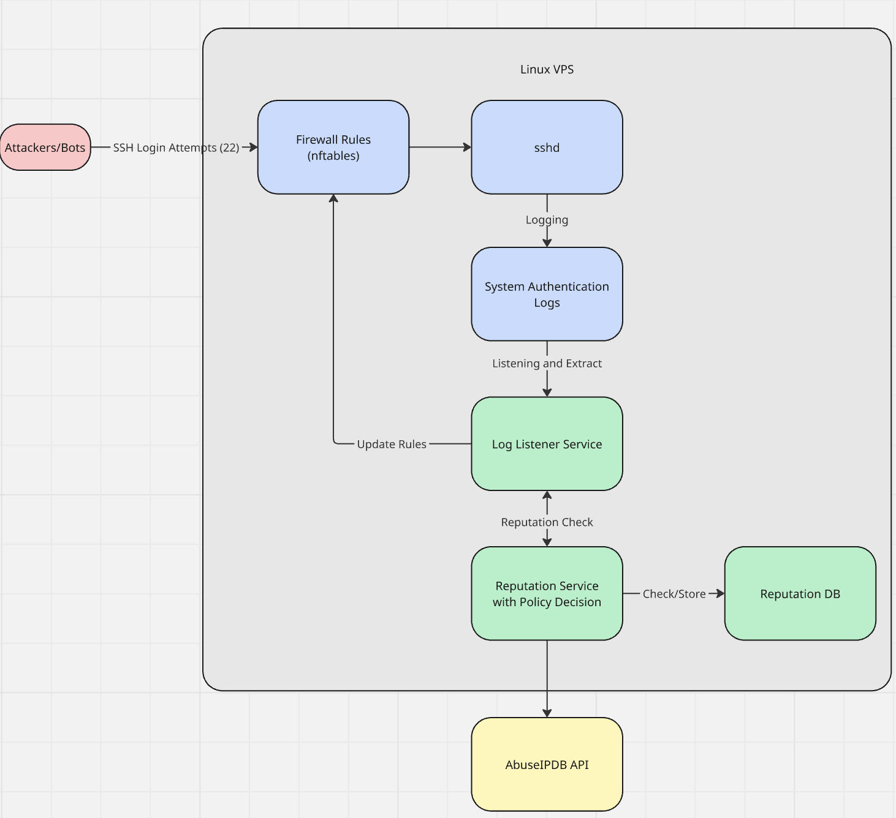

# Detecting Repeated SSH Connections via Autonomous System Reputation

## About

A lightweight security system that detects and blocks repeated SSH authentication attempts on a Linux VPS using Autonomous System (AS) reputation. The system monitors authentication logs, evaluates attacker reputation, and dynamically updates nftables firewall rules to prevent malicious connections.

---

## Program Flow Summary
1. Monitors ssh.service logs through systemd.journal.
2. Extracts source IPs from specific failed or suspicious SSH log messages.
3. Sends the IP to reputation_service.
4. Validates that the IP is a real global/public address.
5. Checks the local SQLite cache.
6. Calls AbuseIPDB only if:
    6.1 the IP is not in cache, or
    6.2 the cache is expired and the IP has exceeded the connection threshold.
7. Stores or updates the IP record in SQLite.
8. Returns whether the IP should be blocked.
9. If blocked, adds the IP to an nftables ban set with a 12-hour timeout.

The goal is to reduce repeated malicious SSH connection attempts by using IP reputation data together with a local cache, instead of calling the external API on every single connection. 

---
## Files

| File | Description |
|-----|-------------|
| `listener_service.py` | Monitors SSH logs using `systemd.journal`, extracts IPs from suspicious login attempts, and triggers the reputation check. |
| `reputation_service.py` | Performs IP reputation checks using AbuseIPDB, manages the SQLite cache, and decides whether an IP should be blocked. |
| `ssh_auto_ban-default.nft` | `nftables` firewall configuration that stores banned IPv4/IPv6 addresses and drops their traffic. |

---
## Installation

Prerequisites
Make sure the following are installed:
- Python 3.8+
- pip
- nftables
- systemd (Linux)
- access to system journal

API keys
- Create an AbuseIPDB account and generate an API key (https://www.abuseipdb.com/)
```bash
# Add environment variables to your shell config (~/.bashrc or ~/.zshrc)
export ABUSEIPDB_API_KEY="your_key_here"
export REPUTATION_DB_PATH="path_to_database/reputation.sqlite"

# Reload shell configuration
source ~/.bashrc   # or: source ~/.zshrc
```

Installation
```bash
# Clone repository
git clone https://github.com/nthanapaisal/ssh-auth-attempt-reputation-based-ban.git
cd ssh-auth-attempt-reputation-based-ban

# Install dependencies
pip install -r requirements.txt
```

Run the program
```bash
# Run the SSH listener service
sudo python listener_service.py
``` 

---

## Architecture Diagram


---
## Detailed Flow:
listener_service.py
```
1. The program starts and loads the default `nftables` rules from `ssh_auto_ban-default.nft`.

2. It opens the system journal and listens only for entries from `ssh.service`.

3. It waits for new log entries in real time using `poll()`.

4. When a new SSH log message is appended, it reads the message text from the journal entry.

5. The message is passed into `extract_ip(msg)`.

6. `extract_ip(msg)` checks the log line against specific SSH failure patterns:
   - `Failed password for ... from <ip>`
   - `Unable to negotiate with <ip>`
   - `banner exchange: Connection from <ip>`
   - `Invalid user ... from <ip>` or `Connection closed by authenticating user ...`  
     only if `SSH_HAS_PASS_AUTH_DISABLED` is set to `Tru

7. If the log message does not match any of those patterns, the program ignores it.

8. If a match is found, the source IP is extracted from the regex match.

9. The extracted IP is sent to `handle_bad_ip(ip)`.

10. `handle_bad_ip(ip)` calls `reputation_service(db, ip)` to decide whether the IP should be blocked.

11. If `reputation_service` returns `True`, the listener calls `ban_bad_ip(ip)`.

12. `ban_bad_ip(ip)`:
   - checks whether the IP is IPv4 or IPv6
   - chooses the correct nftables set (`banned_v4` or `banned_v6`)
   - runs `nft add element ... { <ip> timeout 12h }`

13. The IP is then temporarily banned for 12 hours.

14. If `reputation_service` returns `False`, the listener does nothing except print that the IP is being ignored.
```

reputation_service.py
```
## Reputation Service Flow

1. The listener sends a suspicious IP address to `reputation_service`.

2. The service first validates the IP using `ipaddress.ip_address()`.

3. If the IP is not a **global/public internet-routable address**, the service immediately returns **False** (do not block).

4. The service checks the local SQLite database for an existing record of the IP.

5. If the IP is **not found in the database**:
   - The service queries the AbuseIPDB API.
   - It retrieves the abuse confidence score and related metadata.
   - If the score exceeds the block threshold (80), the IP is marked as blocked.
   - Store the result in the database.

6. If the IP **already exists in the database**:
   - If the IP is already marked as blocked, the service immediately returns **True**.
   - The connection counter for that IP is incremented.

7. If the IP is **not blocked and the cache is still fresh** (within 1 hour):
   - The service returns **False** and updates the connection counter.

8. If the cache is **expired**:
   - The service checks whether the number of connections exceeds the **connection threshold (20)**.

9. If the connection threshold is exceeded:
   - The service queries AbuseIPDB again for a refreshed score.
   - The database record is updated with the new reputation data.

10. If the cache is expired **but the connection threshold is NOT exceeded**: 
   - Do not call AbuseIPDB.
   - Update the connection counter.
   - Allow the IP.

Notes: 9-10: expired cache and why only check IP that is freq: only checked when this expired IP is showing up often enough to matter.

11. The final decision (**block or allow**) is returned to the listener.

12. The listener then decides whether to add the IP to the `nftables` ban list.
```

ssh_auto_ban-default.nft
```
nftables firewall configuration file

1. Creates an `nftables` table named `ssh_auto_bans` for managing automatic SSH bans.

2. Defines two IP sets used to store banned addresses:
   2.1 `banned_v4` for IPv4 addresses.  
   2.2 `banned_v6` for IPv6 addresses.  
   2.3 Both sets support automatic expiration using timeout flags.

3. Attaches a rule to the `input` chain of the firewall.

4. For every incoming packet:
   4.1 If the source IP is in `banned_v4`, the packet is logged and dropped.  
   4.2 If the source IP is in `banned_v6`, the packet is logged and dropped.

5. The Python listener dynamically inserts IPs into these sets with a timeout (12 hours), causing the firewall to automatically block traffic from those addresses.
```